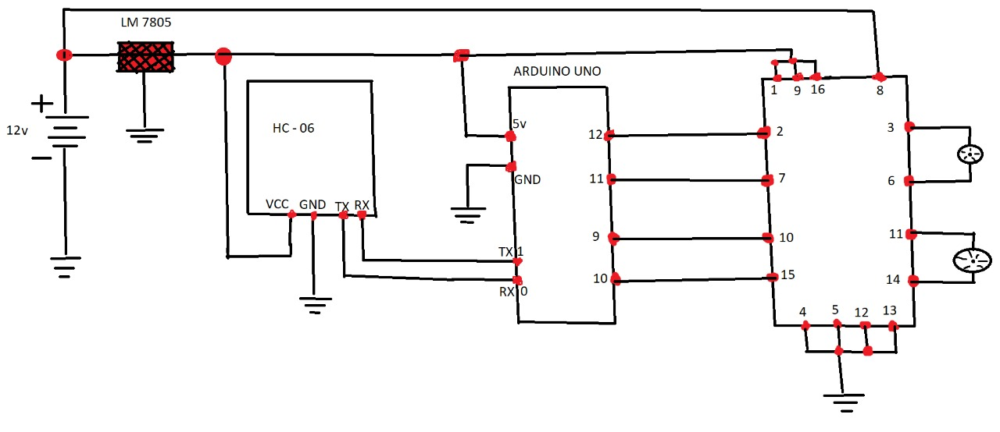

# Robotic Pet Monitoring Prototype

Academic robotic prototype focused on remote monitoring and interaction with pets at home.

## 📌 Overview

This robot was designed to allow pet owners to monitor and interact with their pets when they are not physically present.

The system aims to improve:

- Pet well-being  
- Owner peace of mind  
- Remote environment supervision  

## ⚙️ Technologies Used

- Arduino Uno  
- HC-06 Bluetooth Module  
- DC Motors + L298N Driver  
- C++ (Arduino Programming)  
- MIT App Inventor (Mobile App)  
- Electronic Circuit Design  

## 🧠 System Architecture

The system integrates:

- A mobile application (MIT App Inventor)  
- Bluetooth communication (HC-06)  
- Arduino-based motor control  
- External 12V power supply for motor stability  

## 🎯 Project Goal

To explore technological solutions applied to animal care through automation and remote monitoring systems.

## 📄 Full Report

The complete academic report (Spanish) can be found here:

[View Full Report](docs/report.pdf)

## 🖨️ 3D Model

The 3D chassis model was designed in Tinkercad.

🔗 View the 3D model here:  
[Open 3D Model in Tinkercad](https://www.tinkercad.com/things/4FBuiCZtKAR-swanky-migelo-duup/edit?returnTo=%2Fthings%2F4FBuiCZtKAR-swanky-migelo-duup&sharecode=EmdXrJour8bPZoi1gZITJQM-_vuCPaGRqrhN4HO2zxU)

## 🔌 Circuit Design

## 📷 Prototype Images

## ✅ Project Status

Completed - Academic Project (2024)

2024
